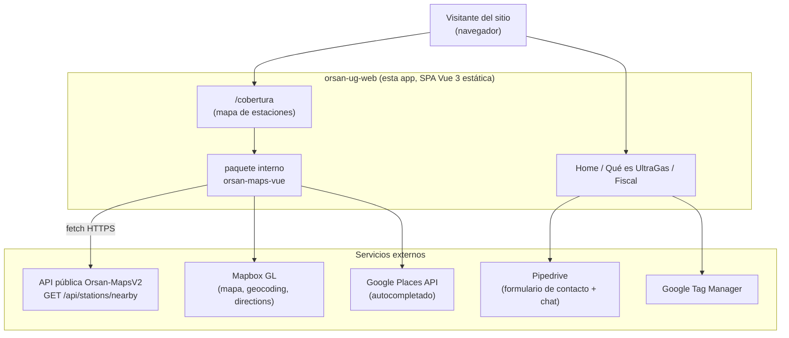
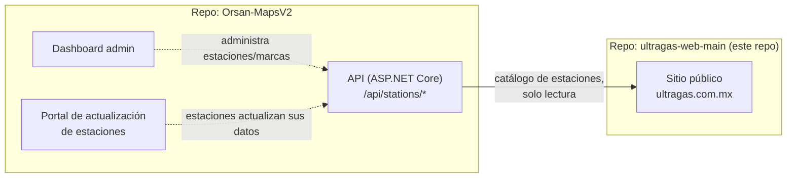

# UltraGas Web — Guía del Proyecto

> ¿Buscas el README original (plantilla de Vite)? Está en [`docs/README_ORIGINAL.md`](docs/README_ORIGINAL.md). Este README es un mapa completo del proyecto: qué es, cómo se integra con el resto del sistema Orsan y cómo se despliega.

---

## 1. ¿Qué es este proyecto?

**`orsan-ug-web`** es el **sitio público de UltraGas** (`ultragas.com.mx`): la página de marketing/producto de **UltraGas Control Card** (control de combustible para flotas) y, dentro de ese mismo sitio, el **buscador/mapa de cobertura nacional de estaciones** afiliadas a UltraGas.

Es una **SPA (Single Page Application)** hecha con **Vue 3 + Vite**, sin backend propio: todo el contenido es estático y las únicas piezas "dinámicas" son llamadas a APIs externas (la API de estaciones de Orsan, Mapbox, Google Places) y a servicios de terceros para formularios y chat (Pipedrive).

Este repo **no reemplaza ni compite** con `Orsan-MapsV2`; es un **consumidor** de su API pública. Ver sección 5.

## 2. Alcance (qué hace y qué no hace)

**Sí hace:**
- Muestra la página de producto de UltraGas Control Card (home, "Qué es UltraGas", información fiscal/facturación) — contenido mayormente estático con secciones de marketing.
- Muestra un **mapa interactivo de cobertura nacional** (`/cobertura`) que busca estaciones cercanas a un punto, con filtros por servicio (Magna/Premium/Diesel) y por amenidades (24 horas, baños, tienda, etc.), usando la API pública de `Orsan-MapsV2`.
- Traza rutas hacia una estación (Mapbox Directions) y autocompleta direcciones (Google Places).
- Captura leads/contacto a través de formularios embebidos de **Pipedrive** (CRM externo) — no hay backend propio de formularios en este repo.
- Enlaza (como links externos, no como integración) hacia otros portales legacy de UltraGas: portal de clientes (`ultragas.com.mx/Clientes`, `/Consultas2`) y de afiliados (`/Afiliadas`, `/SistemaAfiliadas`).

**No hace (fuera de alcance):**
- No tiene base de datos ni backend propio: **es 100% frontend estático**.
- No gestiona el catálogo de estaciones — solo lo **consulta** en modo lectura desde la API de `Orsan-MapsV2`.
- No procesa el envío de formularios de contacto — eso lo hace Pipedrive (script embebido).
- No corre en contenedores en producción: se publica como sitio estático en **IIS** (ver sección 8).

---

## 3. Arquitectura general



- **No hay servidor de aplicación propio.** El "backend" de este sitio es, en la práctica, la API de `Orsan-MapsV2` (para estaciones) más servicios SaaS de terceros (Mapbox, Google, Pipedrive, GTM).
- El sitio se sirve como **archivos estáticos** (`npm run build` → `dist/`) detrás de IIS.

---

## 4. Funcionalidad

### 4.1 Páginas (`src/views`, rutas en `src/router/index.js`)

| Ruta | Vista | Contenido |
|---|---|---|
| `/` | `HomeView.vue` | Landing de producto: hero, problema/solución, tecnología, partners, cobertura (resumen), comparativa, casos de éxito, FAQ. |
| `/cobertura` | `StationsView.vue` | Mapa interactivo de estaciones a pantalla casi completa + trazado de rutas + estadísticas de cobertura. |
| `/fiscal` | `FiscalView.vue` | Información de facturación/fiscal (CFDI, diagramas). |
| `/que-es-ultragas` | `QueEsUltraGasView.vue` | Contenido informativo sobre la empresa/servicio. |
| `/gracias` | `GraciasView.vue` | Página de confirmación tras enviar un formulario. |
| `*` | `NotFoundView.vue` | 404. |

`AppHeader.vue` es compartido por todas las páginas y contiene, además de la navegación, dos modales que **enlazan a sistemas externos** (no manejados por este repo): `PortalModal` (portal de clientes: `ultragas.com.mx/Clientes`, `/Consultas2`) y `AffiliatesModal` (portal de afiliados: `/Afiliadas`, `/SistemaAfiliadas`).

### 4.2 El mapa de cobertura — paquete `orsan-maps-vue`

`packages/orsan-maps-vue/` es un **paquete interno, pensado para copiarse a otros proyectos Vue** (así lo indica su propio README): encapsula todo lo necesario para mostrar el mapa de estaciones con Mapbox.

| Archivo | Rol |
|---|---|
| `components/MapView.vue` | Componente principal (`OrsanMapView`). Inicializa Mapbox, pide geolocalización o usa el centro del mapa, y llama a la API de estaciones al mover/hacer zoom. |
| `components/FilterPanel.vue` | Filtros: búsqueda por texto, servicios (combustibles), amenidades. |
| `components/StationDetailsPanel.vue` | Detalle de una estación seleccionada (dirección, servicios, amenidades, distancia). |
| `composables/useGooglePlacesAutocomplete.js` | Autocompletado de direcciones con Google Places. |
| `config/api.js` | Define `API_BASE_URL` desde `VITE_API_BASE_URL`. |
| `config/mapbox.js` / `config/google.js` | Tokens de Mapbox/Google desde variables de entorno. |

El proyecto principal también tiene su propio flujo de **trazado de ruta** en `src/components/stations/RouteModal.vue` (usa Mapbox Geocoding + Directions directamente, fuera del paquete `orsan-maps-vue`).

### 4.3 Integración con la API de estaciones (contrato real observado en el código)

`MapView.vue` (y `RouteModal.vue`) llaman a:

```
GET {VITE_API_BASE_URL}/api/stations/nearby
    ?latitude=...&longitude=...&radius=...
    &search=...                  (opcional, texto libre)
    &services[]=...              (opcional, repetible: un valor por servicio)
    &has_24_hours=true            (opcional)
    &has_restrooms=true           (opcional)
    &has_rest_area=true           (opcional)
    &has_convenience_store=true   (opcional)
    &has_restaurant=true          (opcional)
    &has_charging_positions=true  (opcional)
    &has_truck_stop=true          (opcional)
```

Este es el mismo endpoint documentado en `Orsan-MapsV2` (`api/Controllers/StationController.cs`, acción `nearby`); los parámetros de amenidades/servicios se traducen aquí desde nombres en `camelCase` (estado interno del filtro) a `snake_case` (query string) — ver `fetchStations()` en `MapView.vue`.

> **Importante:** si el equipo de `Orsan-MapsV2` cambia la forma de la respuesta de `/api/stations/nearby` o los nombres de estos parámetros, hay que actualizar `MapView.vue` y `RouteModal.vue` aquí. No existe un contrato versionado entre ambos repos más allá de este acuerdo implícito.

### 4.4 Formularios y captura de leads

No hay backend de formularios en este repo. `ContactFormModal.vue` embebe un formulario web de **Pipedrive** (`webforms.pipedrive.com/f/...`) vía script; el chat flotante (`leadbooster-chat.pipedrive.com`) se carga en `index.html`. Todo el manejo de leads ocurre del lado de Pipedrive.

---

## 5. Relación con el resto del sistema Orsan

Este repo es uno de los **consumidores externos** de la API de estaciones. El ecosistema completo:



- `Orsan-MapsV2` es dueño del **catálogo de estaciones** (dónde están, qué ofrecen, sus datos) y lo mantiene actualizado (sincronización desde catálogos legacy, portal de autoactualización, dashboard admin).
- **Este repo (`ultragas-web-main`) solo lee** ese catálogo a través del endpoint público `/api/stations/nearby` para pintar el mapa de cobertura al público.
- Los demás enlaces del sitio (portal de clientes, portal de afiliados) apuntan a **otros sistemas legacy de UltraGas** (`ultragas.com.mx/Clientes`, `/Afiliadas`, etc.) que **no** forman parte de `Orsan-MapsV2` ni de este repo.

---

## 6. Escalabilidad

- **Es un sitio 100% estático:** una vez compilado (`dist/`), escala trivialmente — se puede servir desde varios servidores IIS, un CDN, etc., sin lógica de servidor propia.
- El único componente con capacidad de "fallar bajo carga" es la **API de `Orsan-MapsV2`**, de la que depende el mapa de cobertura; este repo no controla esa escalabilidad (ver el README de `Orsan-MapsV2`).
- Mapbox, Google Places y Pipedrive son servicios SaaS de terceros con sus propios límites de uso/cuota (tokens en variables de entorno); vigilar cuotas si el tráfico crece mucho.
- No hay estado del lado del servidor que mantener ni sesiones — cualquier instancia del sitio estático es intercambiable.

---

## 7. Uso rápido (desarrollo local)

Requisitos: **Node.js 20.19+** (ver `.nvmrc` / `.node-version` y `engines` en `package.json`).

```bash
npm install
cp .env.example .env   # y completa los tokens/URLs reales
npm run dev            # http://localhost:5173 (puerto por defecto de Vite)
```

Variables de entorno (`.env`, ver [`.env.example`](.env.example)):

| Variable | Uso |
|---|---|
| `VITE_API_BASE_URL` | Base de la API de estaciones (`Orsan-MapsV2`). Dev típico: `http://localhost:8082`. |
| `VITE_MAPBOX_ACCESS_TOKEN` | Token de Mapbox para el mapa decorativo de la home (`CoverageMapbox.vue`). |
| `VITE_MAPBOX_TOKEN` | Token de Mapbox para el mapa interactivo real de `/cobertura` (paquete `orsan-maps-vue`). |
| `VITE_GOOGLE_MAPS_API_KEY` | Clave de Google Maps/Places para el autocompletado de direcciones. |

> El repo trae también `.env.pruebas` y `.env.sitio`, usados por los scripts de build de la sección 8 (apuntan a `https://ultragas.com.mx/PruebasApi`, un proxy hacia la API real usado en ambientes de staging/sitio).

---

## 8. Producción: build y despliegue en IIS (sin Docker)

Igual que `Orsan-MapsV2`, este sitio **se despliega como archivos estáticos en IIS**, sin contenedores. El repo incluye `public/web.config`, que termina copiado a `dist/` en cada build — es la configuración que usa IIS para:

- Servir `index.html` como documento por defecto.
- **SPA fallback**: redirigir cualquier ruta que no sea un archivo/carpeta real hacia `index.html` (para que funcione el router de Vue en modo history).
- Cabeceras de seguridad: `X-Frame-Options`, `X-Content-Type-Options`, y una **Content-Security-Policy** que solo permite scripts/conexiones hacia los dominios que el sitio realmente usa (Pipedrive, Mapbox, Google Maps/Analytics, Google Tag Manager).

### Modos de build

El proyecto define dos variantes de build, pensadas para dos ubicaciones distintas dentro de IIS:

```bash
# Sitio de pruebas/staging, publicado bajo una subcarpeta /Pruebas/
npm run build:pruebas   # vite build --mode pruebas --base /Pruebas/

# Sitio productivo, publicado en la raíz del dominio
npm run build:sitio     # vite build --mode sitio --base /
```

Cada modo toma sus variables de `.env.pruebas` o `.env.sitio` respectivamente (Vite las combina con `.env` según el `--mode`). El resultado queda en `dist/`.

### Pasos de despliegue

1. `npm ci`
2. `npm run build:sitio` (o `build:pruebas` para el ambiente de pruebas) — genera `dist/` con `web.config` incluido.
3. Copiar el contenido de `dist/` al directorio físico del sitio/aplicación IIS correspondiente (sitio raíz, o subcarpeta `/Pruebas/`).
4. Verificar que el módulo **URL Rewrite** de IIS esté instalado (lo usa `web.config` para el SPA fallback).
5. Confirmar que `VITE_API_BASE_URL` usado en el build apunta a la API real accesible desde internet (no `localhost`).

> El repo incluye un `dist.zip` con un build previo — es evidencia de que el despliegue actual es manual (compilar y subir/descomprimir en el servidor IIS), no un pipeline de CI/CD automatizado.

---

## 9. Estructura del repositorio

```
ultragas-web-main/
├── src/
│   ├── views/            → Páginas/rutas de la SPA
│   ├── components/       → Componentes de página (home/, stations/, modales, header/footer)
│   ├── composables/      → Estado compartido de modales, carrusel, video
│   ├── data/             → Datos estáticos (geojson de México, bounds, puntos del mapa decorativo)
│   └── router/           → Definición de rutas (Vue Router)
├── packages/
│   └── orsan-maps-vue/   → Paquete "copiable" del mapa de estaciones (Mapbox + API de Orsan-MapsV2)
├── public/
│   ├── web.config        → Configuración IIS (SPA fallback, headers de seguridad, CSP)
│   └── ...                 imágenes, íconos, sitemap
├── docs/                 → Documentación del proyecto (este índice)
├── .env.example           → Plantilla de variables de entorno para desarrollo
├── .env.pruebas / .env.sitio → Variables usadas por los builds de staging/producción
└── vite.config.js
```

---

## 10. Licencia

Sin especificar (proyecto privado, `"private": true` en `package.json`).
